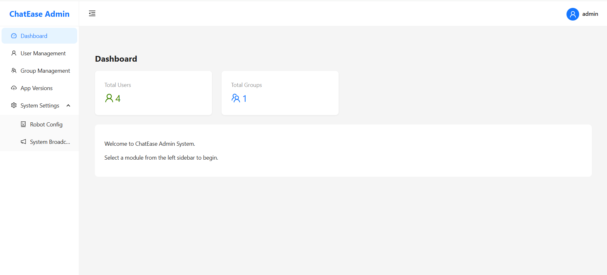
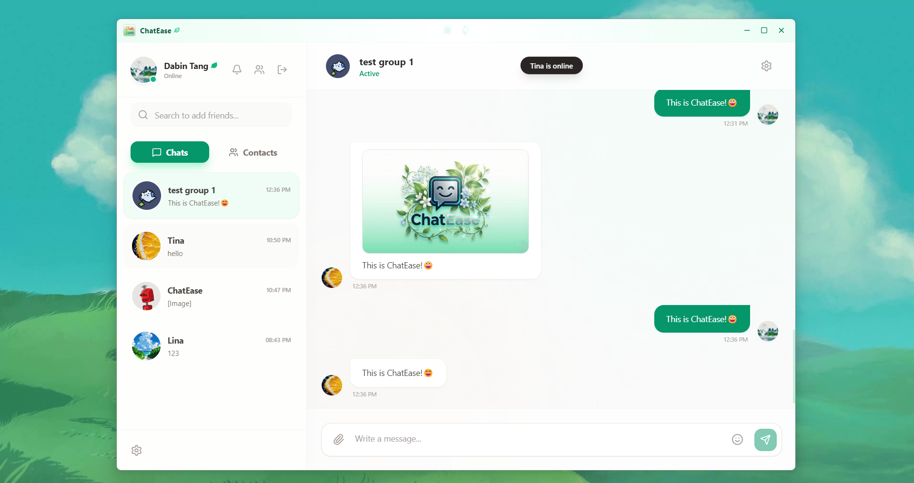

# ChatEase - Cross-Platform IM Client

## Introduction
ChatEase Frontend is a modern, cross-platform Instant Messaging (IM) client built with **React**, **Vite**, and **Electron**. It provides a seamless messaging experience on both Web and Desktop environments.
The project consists of two parts: a **User Client** (Web + Desktop) and an **Admin Dashboard**.
> 🔗 **Backend Repository:** This frontend requires the backend service to function. Please visit [ChatEase Backend](https://github.com/dabin-tang/chatease-backend) to setup the server first.

## 📸 Screenshots

<div align="center">
  
  <p><i>admin Interface</i></p>
</div>

<br/>

<div align="center">
  
  <p><i>client Interface</i></p>
</div>

---

## Tech Stack

### Core Frameworks
* **TypeScript**: Strict type checking for robust code.
* **React 18**: Component-based UI library.
* **Vite**: Next-generation frontend tooling (High-performance bundler).
* **Electron**: For building cross-platform desktop applications (Windows/macOS/Linux).

### State Management & Network
* **Zustand**: A small, fast, and scalable bearbones state-management solution.
* **Axios**: Promise-based HTTP client for REST API interaction.
* **Native WebSocket**: Real-time full-duplex communication.

### UI & Styling
* **Tailwind CSS**: Utility-first CSS framework for rapid UI development.
* **Lucide React**: Beautiful & consistent icon set.
* **Sonner**: An opinionated toast component for React.
* **Emoji Picker React**: Comprehensive emoji support.

### Build & Dev Tools
* **ESLint**: Pluggable JavaScript linter.
* **PostCSS**: Tool for transforming CSS with JavaScript.
* **Electron Builder**: For packaging desktop executables.

---

## Project Structure


```text
ChatEase_Frontend
├── .gitignore          # Global git ignore 
├── README.md           # Project documentation
├── screenshots         # Images for README
│
├── admin               # Admin Dashboard (React + Vite)
│   ├── src
│   │   ├── pages       # Dashboard pages 
│   │   ├── services    # API services
│   │   └── utils       # Helper functions
│   └── ...
│
└── client              # User Client(React + Vite + electron)
    ├── electron        # Electron Main Process
    │   ├── main.ts     # Window creation & System events
    │   └── preload.ts  # Context bridge
    ├── src             # Renderer Process (React App)
    │   ├── api         # Axios instance & interceptors
    │   ├── assets      # Static assets (Images, Icons)
    │   ├── components  # Reusable UI components (Modals, Cards)
    │   ├── pages       # Main views (Home, Login, Register)
    │   ├── store       # Zustand state management
    │   └── ...
    └── ...
```

## ⚡ Quick Start

### Prerequisites
* **Node.js**: v16+ recommended
* **npm** or **yarn**

### 1. Installation

This project follows a monorepo-like structure.

```bash
# One-Click Install (Windows/Mac/Linux):
cd client && npm install && cd ../admin && npm install && cd ..

# If you want to install the two parts separately:
# User Client:
cd client && npm install
# Admin Dashboard:
cd admin && npm install
```

### 2. Configuration

Ensure the backend server is running (Default: `http://localhost:8080`).

If you need to change the API base URL, modify `src/api/axios.ts` in the respective project (both `client` and `admin`):

```typescript
// src/api/axios.ts
const BASE_URL = 'http://localhost:8080'; // Update this if your backend runs elsewhere
```

## 🚀 Running the Project

### User Client (Web Mode)
Start the Vite development server for browser access:
```bash
cd client
npm run dev
```
### User Client (Desktop Mode)
Start the Electron application (Window/Mac/Linux):
```bash
cd client
npm run electron:dev
```
### Admin Dashboard
Start the Admin management panel:
```bash
cd admin
npm run dev
```
## 📦 Building

To build the project:

### User Client (Web)
Build the static web files:
```bash
cd client
npm run build
```
### User Client (Desktop App)

Package the application into an executable installer (e.g., `.exe`, `.dmg`):

```bash
cd client
npm run electron:build

The executable installers will be generated in the client/release directory.
```
### Admin Dashboard

Build the static admin panel:

```bash
cd admin
npm run build

The output will be in the admin/dist directory.
```

## 👨‍💻 Author

GitHub: https://github.com/dabin-tang

Email: [dabint2003@gamil.com]

If you like this project, please give it a Star ⭐️!